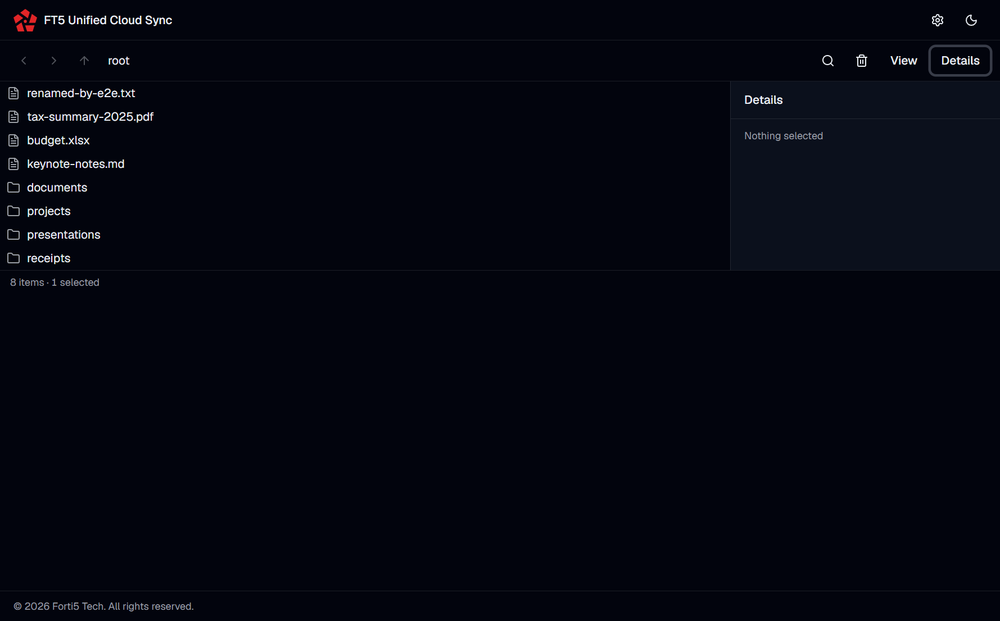

# File Explorer — Design Reference

_Last updated: 2026-04-20 (ui-file-explorer, Phase 9)._

This document is the human-readable companion to the `ui-file-explorer`
OpenSpec change. It synthesizes layout, state machines, keyboard bindings,
accessibility contracts, and the search-scope decision so a future
contributor does not have to reassemble them from the spec + decisions.

The **binding artifacts** are:

- Spec (behavioural): [`specs/file-explorer/spec.md`](./specs/file-explorer/spec.md)
- Decisions: [`design.md`](./design.md)
- Proposal (scope): [`proposal.md`](./proposal.md)
- Playwright e2e: [`apps/desktop/e2e/file-explorer.spec.ts`](../../../../apps/desktop/e2e/file-explorer.spec.ts)

When this doc and any of the above disagree, the above win and this doc is
stale — file a docs PR.

---

## 1. Overview

The File Explorer is the surface reached from a datasource card's
quick-actions menu ("Explore"). v1 scope: browse, rename (files only),
delete (single + multi-select with per-entry partial-failure),
download, and search — all against an in-memory mock file system with
the shipping `window.api.files.*` IPC contract. Real provider-backed
handlers land in a follow-up. The mental model is classic Windows
Explorer — back / forward / up, breadcrumb, main pane with six
switchable view modes, right-side details pane, right-click context
menu, toolbar, status row. Visually it extends `ui-ux-design`'s
Linear/Vercel dense-quiet direction (Geist Sans / Geist Mono,
`tabular-nums`, no new tokens; see design.md Decision 9).

---

## 2. Layout diagrams

### 2.1 Composite layout

```
+------------------------------------------------------------------+
| [◀] [▶] [↑] │ root › projects › docs    │ [Del] [Sort▾] [Search] │   <- HistoryButtons │ Breadcrumb │ Toolbar
|             │                           │          [View▾] [ℹ]    |
+------------------------------------------------------------------+
|                                                    |             |
|  MAIN PANE                                         |   DETAILS   |
|  (one of six view-mode renderers below)            |   PANE      |
|                                                    |  (320 px,   |
|                                                    |   toggle)   |
|                                                    |             |
+------------------------------------------------------------------+
|  12 items · 3 selected                                           |   <- Status row (aria-live)
+------------------------------------------------------------------+
```

- HistoryButtons, Breadcrumb, Toolbar sit on one row at the top.
- Main pane is in the middle; the Details pane is an optional right-side
  panel (320 px fixed width, toggled from the toolbar).
- Status row is pinned at the bottom (`text-xs text-muted-foreground`,
  `aria-live="polite"`).
- A Playwright-captured screenshot of the default Details mode is
  checked in for visual reference:

  

### 2.2 View modes

Six modes are implemented as independent cell renderers consuming the
same `Entry[]`, selection, sort, and keyboard callbacks. The View
picker in the toolbar swaps the renderer; no other state changes.
Default is **Details**. Cell sizes are per design.md Decision 3.

#### List — 1 row, compact, vertical flow

```
📄 report-q1.pdf
📄 report-q2.pdf
📁 archives
```

| Property | Value |
|---|---|
| Cell | 1-row, icon + name |
| Metadata | name only |
| Flow | vertical, no wrap |

#### Details — 1 row, table-like grid (default)

```
┌─────────────────────────────────────────────────────────────────┐
│ Name              │ Type      │ Size       │ Modified           │
├─────────────────────────────────────────────────────────────────┤
│ 📄 report-q1.pdf  │ document  │ 1.2 MB     │ 2026-03-04 09:12   │
│ 📄 report-q2.pdf  │ document  │ 2.4 MB     │ 2026-04-01 14:30   │
│ 📁 archives       │ folder    │    —       │ 2026-02-15 08:00   │
└─────────────────────────────────────────────────────────────────┘
```

| Property | Value |
|---|---|
| Cell | 1-row, data-dense |
| Columns | icon, name, type, size, modified |
| Flow | table-like grid, column headers sort |
| Numerics | `tabular-nums` for size + modified |

#### Small Icons — 16 px icon + name, wrapping flex

```
📄 a.txt  📄 b.txt  📄 c.txt  📄 d.txt  📄 e.txt
📁 sub    📄 f.txt  📄 g.txt  📄 h.txt
```

| Property | Value |
|---|---|
| Cell | 16 px icon + name inline |
| Metadata | name only |
| Flow | wrapping flex |

#### Tiles — 64 px icon, metadata beside the icon

```
┌────────────────────┐  ┌────────────────────┐
│  📄  report-q1.pdf │  │  📄  report-q2.pdf │
│      document       │  │      document       │
│      1.2 MB         │  │      2.4 MB         │
└────────────────────┘  └────────────────────┘
```

| Property | Value |
|---|---|
| Cell | 64 px icon + 2 lines metadata |
| Metadata | type + size beside icon |
| Flow | wrapping grid |

#### Medium Icons — 64 px icon above name, wrapping grid

```
┌──────┐  ┌──────┐  ┌──────┐
│  📄  │  │  📄  │  │  📁  │
│ q1…  │  │ q2…  │  │ arc… │
└──────┘  └──────┘  └──────┘
```

| Property | Value |
|---|---|
| Cell | 64 px icon above name |
| Metadata | name only (truncated, title-attributed) |
| Flow | wrapping grid |

#### Large Icons — 96 px icon above name, wrapping grid

```
┌─────────┐  ┌─────────┐  ┌─────────┐
│         │  │         │  │         │
│   📄    │  │   📄    │  │   📁    │
│         │  │         │  │         │
│report…  │  │report…  │  │archives │
└─────────┘  └─────────┘  └─────────┘
```

| Property | Value |
|---|---|
| Cell | 96 px icon above name |
| Metadata | name only (truncated) |
| Flow | wrapping grid |

---

## 3. Operation lifecycle

Every rename and delete operation is represented in the store as a
pending-op keyed by entry id. See design.md Decision 7 for the canonical
flow.

```
  idle
   │
   │ user commits (rename / delete)
   ▼
  pending             pendingOps[id] = { kind, startedAt }
   │                  UI: opacity-60 + animate-sync-pulse + actions disabled
   │                  (for rename: name shows the new requested name)
   │                  (for delete: row dimmed + struck-through)
   │ IPC awaited
   │
   ├── success ───► idle
   │                 rename: entry updated in place with response's FileEntry
   │                 delete: entry removed from entries[]
   │                 sonner toast: "Renamed to X" / "Deleted N items"
   │                   (Undo affordance only if provider.capabilities.trash)
   │
   └── failure ───► idle
                    UI reverts to pre-operation state
                    lastError = { entryId, reason } set on store
                    inline error icon + tooltip on the entry
                    sonner toast with the reason
                    multi-delete partial failure: per-entry per
                    FilesRemoveResponse.failed[]
```

Per-entry visual affordance during `pending`:

- `opacity-60`
- `animate-sync-pulse` glyph (whitelisted in motion budget)
- cursor `wait`
- entry-level quick-actions (menu items, inline edit) disabled

Toast semantics via `sonner`:

- Success: informational, auto-dismiss, optional Undo.
- Failure: destructive variant, the reason from
  `FilesRemoveResponse.failed[].reason` or the rename rejection text.
- Partial failure: one aggregate toast (`"Deleted 2 of 3 items; 1 failed"`)
  with a "View details" affordance.

The v1 implementation is naive: the store `await`s the handler in the
action. A future background file-operations service consumes the same
`pendingOps` shape without UI churn.

---

## 4. Selection state machine

Selection state is owned by the store (`selection: Set<string>`) plus a
range anchor kept stable across shift-clicks (see commit
`5873656 fix(file-explorer): keep range-select anchor stable across
shift-clicks`). Focus state is ephemeral UI state on the
`useKeyboardNav` hook (design choice: focus resets on view-mode switch
and path navigation; it is not persisted).

```
                      ┌──────────────┐
                      │    empty     │
                      └──────┬───────┘
                             │
               click(id) ──► │
                             ▼
                      ┌──────────────┐
             ctrl-    │  single-     │ ──► ctrl-click(other) ──► multi
             click    │  selection   │ ──► shift-click(other) ──► range
             same ────┘              │ ──► arrow-key          ──► focus-only*
                                     │ ──► select-all         ──► multi
                                     │ ──► click(empty-space) ──► empty
                                     └──────┬───────┘
                                            │ shift-arrow
                                            ▼
                                    ┌──────────────┐
                                    │ range-being- │  (anchor stays at
                                    │   extended   │   first-click; moving
                                    └──────┬───────┘   endpoint redraws
                                            │          the range every step)
                                            │
                                            ▼
                                    ┌──────────────┐
                                    │    multi     │
                                    └──────┬───────┘
                                           │ clear / click(empty) / Escape
                                           ▼
                                        empty
```

\* Arrow keys without Shift move *focus only*; selection is unchanged
until Shift is held.

Notes:

- The **range anchor** is the first entry the user clicked (or the most
  recent non-shift click). Subsequent shift-clicks re-draw the range
  from that anchor to the new endpoint. Previously the implementation
  stomped the anchor with every shift-click; the fix (commit `5873656`)
  pins it until a non-shift interaction happens.
- `ctrl/cmd+click` toggles a single id in / out of the selection without
  touching the anchor.
- `Ctrl/Cmd+A` selects every entry in the current view (including
  search results if active).
- Entering search or clearing search has **selection side-effects**
  described in §7 below.

---

## 5. Keyboard bindings

Canonical source: [`use-keyboard-nav.ts`](../../../../apps/desktop/src/renderer/src/features/file-explorer/use-keyboard-nav.ts).

| Key | Action | Context |
|---|---|---|
| ArrowUp / ArrowDown | Move focus within the visible, sort-resolved entries | Main pane, any view mode |
| Home / End | Focus first / last entry | Main pane |
| Shift+ArrowUp / Shift+ArrowDown | Move focus AND extend range selection (`store.select(id, "range")`) | Main pane |
| Enter | Activate the focused entry (navigate into directory; Properties modal for a file per design.md Open Questions) | Main pane |
| Delete | Initiate delete-confirm dialog on the current selection | Main pane, non-empty selection |
| F2 | Start inline rename (files only; directory rename disabled in v1) | Main pane, file focused |
| Ctrl+A / Cmd+A | Select all entries in the current view | Main pane, toolbar not focused |
| Shift+F10 / Menu key | Open context menu at the focused entry | Main pane, entry focused |
| Escape | Cancel inline edit; close context menu; close confirm-delete / Properties modal | Inside the edit / menu / modal |
| Tab / Shift+Tab | Move between landmark regions (history buttons → breadcrumb → toolbar → main pane → details pane → status) | Anywhere in the explorer |
| Ctrl+Shift+D / Cmd+Shift+D | **Global**: jump to diagnostics (not an explorer-specific binding; mentioned here for completeness — see commit `6eff5ff feat(renderer): add Ctrl/Cmd+Shift+D shortcut to jump to diagnostics`) | Anywhere in the app |

Deferred (see §8): Alt+D to focus the breadcrumb address bar for direct
path entry (classic Windows Explorer muscle memory; not in v1 — see
design.md Open Questions).

---

## 6. Accessibility notes

Semantic HTML is preferred over ARIA wherever possible; ARIA is used
only when semantics are insufficient.

- **History + Toolbar row**: `role="toolbar"` wraps the history
  buttons + breadcrumb + toolbar cluster; each button has an accessible
  name even when rendered icon-only.
- **Breadcrumb**: `<nav aria-label="Folder path">` with an ordered list.
  Every segment is a keyboard-focusable button with a visible focus ring.
- **Main pane**: `role="grid"` on the outer container; each entry is
  `role="gridcell"` (or `role="option"` in List mode). A roving-tabindex
  pattern is used: only one cell is `tabindex=0` at a time; the rest
  are `tabindex=-1`. Arrow keys move focus; Tab moves focus out of the
  grid to the next landmark.
- **Status row**: `role="status" aria-live="polite"`. Selection count
  and search-truncation notices update it within one render.
- **Details pane**: labelled as a `<section aria-label="Details">`;
  when the open state changes, focus is NOT stolen — the pane simply
  reflects the current selection.
- **Context menu**: focus-trapped while open; Escape restores focus
  to the invoking entry.
- **Confirm-delete and Properties modals**: focus-trapped; Escape
  dismisses; first focus lands on the dismiss / cancel button (not the
  destructive action); focus restores to the invoking entry on close.
- **Post-navigate focus**: after navigating into a directory, focus is
  scheduled on the first entry of the new folder (not left on the
  breadcrumb segment or the back button) so keyboard users can continue
  flowing.
- **WCAG**: AA contrast is guaranteed by the design-token palette used
  for `bg-accent` (selected rows), `opacity-60` (pending rows), and
  `text-muted-foreground` (secondary lines).
- **Caveats from jsdom**: the Vitest tests do not simulate real browser
  tab-cycling semantics (jsdom's focus model is partial). Real-browser
  coverage for the full tab cycle is the responsibility of the
  Playwright e2e added in task 9.3.

---

## 7. Search scope + deferred-provider surface

**Scope is always the full datasource from root in v1.** The renderer
passes `path: "/"` on every `window.api.files.search` call; the handler
treats `path` as the scope-root for future extensibility (scoped
sub-tree search is a cheap follow-up — the contract already has the
slot).

Per-provider behaviour in v1:

| Provider | Handler strategy | Response shape |
|---|---|---|
| Amazon S3 | Client-side paginated `list-objects` scan; names matched client-side; ceiling = `SEARCH_RESULT_CEILING` (50). | `{ entries: FileEntry[], truncated: boolean }`. `truncated: true` when the ceiling is hit. UI surfaces "Showing first N results — scan truncated". |
| Google Drive | Deferred — real native search lands in a follow-up. | `{ entries: [], truncated: true, providerSearchDeferred: true }`. |
| OneDrive | Deferred — real native search lands in a follow-up. | Same as Drive. |

When `providerSearchDeferred === true`, the `<SearchResults>` component
renders a deferred-surface message with provider-named copy (e.g.
_"Native search for Google Drive is not available yet"_) and a link
to [§8 Deferred work](#deferred-work) below. The `DEFERRED_DOCS_HREF`
constant in `search-results.tsx` is
`./openspec/changes/archive/2026-04-21-ui-file-explorer/file-explorer.md#deferred-work`
— self-referential to this document (link is repo-relative; in the renderer
it resolves via the workspace path).

**Selection side-effects around search** (design.md Decision 6,
store.ts `preSearchSelection`):

- **Activate search**: the current selection is snapshotted into
  `state.search.preSearchSelection`.
- **Clear search**: `preSearchSelection` restores the previous
  selection; focus returns to the search-toggle control or the
  previously-focused entry.
- **Navigate while search is active** (e.g. user clicks a result, which
  opens the parent folder): search *and* the pre-search selection are
  both cleared — the user has moved on to a new folder; restoring a
  stale selection from a different folder would be a confusing
  side-effect. This is deliberate (see commit
  `7f5f1bf feat(file-explorer): restore pre-search selection on clear;
  drop on navigate`).

---

## 8. Deferred work

<a id="deferred-work"></a>

These are explicitly out of scope for v1; they are here so a future
contributor can pick them up with context. Ordered roughly by
user-facing impact.

- **Real Drive / OneDrive native search APIs.** Replaces the deferred
  stub in the search handler; the contract is final, only the handler
  bodies change.
- **Real provider-backed handlers** for `list`, `stat`, `rename`,
  `remove`, `download`. v1 ships mocks; real handlers (with OAuth
  plumbing per provider) land in a follow-up change with no UI change.
- **Background file-operations service.** Replaces the naive
  "await the handler in the store" model. Consumes the same
  `pendingOps` shape; owns queue inspection, retry, and backoff.
- **Folder rename.** S3 makes this non-atomic (copy-then-delete across
  a key prefix); deferred until a concrete requirement exists.
- **Move / copy / cut-paste** between directories (including cross-
  datasource operations).
- **Upload from the explorer.** The existing card-level "Upload from
  local" stays in v1; the explorer is browse + modify only.
- **Thumbnails for media files.** Icon views currently show the mime-
  family glyph; a thumbnail pipeline is downstream.
- **File previews.** PDF / image / text viewers. v1 opens Properties on
  Enter; preview is a follow-up surface.
- **Virtualization** for directories exceeding the 300-entry ceiling.
  v1 asserts the ceiling on mock fixtures via a guardrail Vitest test;
  `@tanstack/react-virtual` is the current default candidate per the
  Next.js compatibility table. Escalate only on real evidence.
- **Alt+D** — classic Windows Explorer shortcut to focus the
  breadcrumb address bar for direct path entry. Requires a "type a
  path" input UI we do not otherwise need; deferred per design.md
  Open Questions. Revisit if requested.

---

## 9. Reference links

- OpenSpec change (this directory): [`openspec/changes/archive/2026-04-21-ui-file-explorer/`](./)
- Spec: [`openspec/changes/ui-file-explorer/specs/file-explorer/spec.md`](./specs/file-explorer/spec.md)
- Decisions: [`openspec/changes/ui-file-explorer/design.md`](./design.md)
- Proposal: [`openspec/changes/ui-file-explorer/proposal.md`](./proposal.md)
- Playwright e2e: [`apps/desktop/e2e/file-explorer.spec.ts`](../../../../apps/desktop/e2e/file-explorer.spec.ts)
- Canonical keyboard bindings: [`use-keyboard-nav.ts`](../../../../apps/desktop/src/renderer/src/features/file-explorer/use-keyboard-nav.ts)
- Companion design doc (datasources dashboard): [`datasources-ui.md`](../2026-04-19-ui-ux-design/datasources-ui.md)
- Troubleshooting (Google Drive scope drift / AuthRevokedState): [`google-drive-scope-drift.md`](../2026-04-25-fix-drive-listdirectory-scope-drift/google-drive-scope-drift.md)
